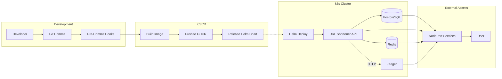
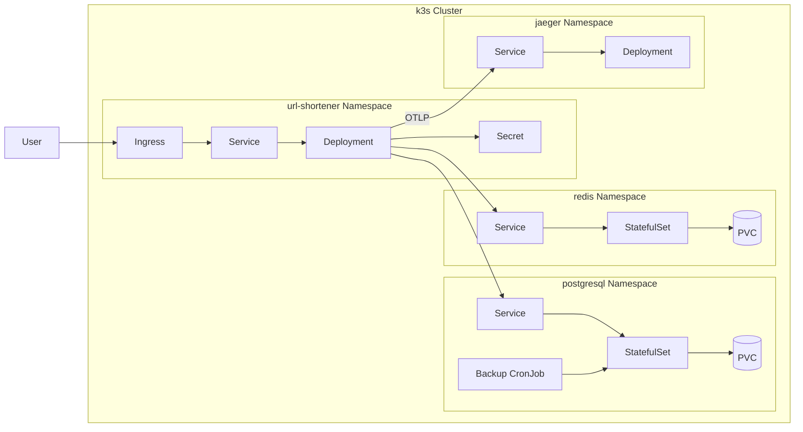
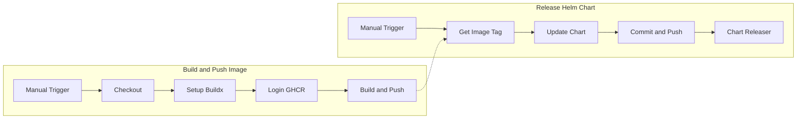
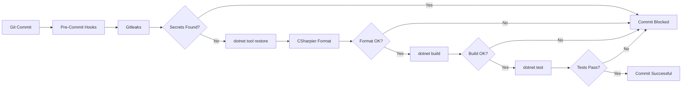

## Architecture Mermaids
[Back to README](/README.md)

### Overview

```mermaid
flowchart LR
   subgraph Dev["Development"]
          A[Developer]
          B[Git Commit]
          C[Pre-Commit Hooks]
    end
   subgraph CI["CI/CD"]
          D[Build Image]
          E[Push to GHCR]
          F[Release Helm Chart]
    end
   subgraph K8s["k3s Cluster"]
          G[Helm Deploy]
          H[URL Shortener API]
          I[(PostgreSQL)]
          J[(Redis)]
          M[Jaeger]
    end
   subgraph Access["External Access"]
          K[NodePort Services]
          L[User]
    end
    A --> B
    B --> C
    C --> D
    D --> E
    E --> F
    F -.-> G
    G --> H
    H --> I
    H --> J
    H -->|OTLP| M
    I --> K
    H --> K
    J --> K
    M --> K
    K --> L
```

### Cluster

```mermaid
flowchart LR
 subgraph K8s["k3s Cluster"]
   subgraph AppNS["url-shortener Namespace"]
        A[Deployment]
        B[Service]
        C[Ingress]
        D[Secret]
    end
   subgraph PGNS["postgresql Namespace"]
        E[StatefulSet]
        F[Service]
        G[(PVC)]
        H[Backup CronJob]
    end
   subgraph RedisNS["redis Namespace"]
        I[StatefulSet]
        J[Service]
        K[(PVC)]
    end
   subgraph JaegerNS["jaeger Namespace"]
        L[Deployment]
        M[Service]
    end
  end
    U[User] --> C
    C --> B
    B --> A
    A --> D
    A --> F
    A --> J
    A -->|OTLP| M
    F --> E
    E --> G
    H --> E
    J --> I
    I --> K
    M --> L
```

### CI/CD Workflow

```mermaid
flowchart LR
 subgraph ImageBuild["Build and Push Image"]
        B["Checkout"]
        A["Manual Trigger"]
        C["Setup Buildx"]
        D["Login GHCR"]
        E["Build and Push"]
  end
 subgraph HelmRelease["Release Helm Chart"]
        G["Get Image Tag"]
        F["Manual Trigger"]
        H["Update Chart"]
        I["Commit and Push"]
        J["Chart Releaser"]
  end
    A --> B
    B --> C
    C --> D
    D --> E
    F --> G
    G --> H
    H --> I
    I --> J
    E -.-> G
```

### pre-commit Workflow

```mermaid
flowchart LR
    A[Git Commit] --> B[Pre-Commit Hooks]
    
    B --> C[Gitleaks]
    C --> D{Secrets Found?}
    D -->|Yes| E[Commit Blocked]
    D -->|No| F[dotnet tool restore]
    
    F --> G[CSharpier Format]
    G --> H{Format OK?}
    H -->|No| E
    H -->|Yes| I[dotnet build]
    
    I --> J{Build OK?}
    J -->|No| E
    J -->|Yes| K[dotnet test]
    
    K --> L{Tests Pass?}
    L -->|No| E
    L -->|Yes| M[Commit Successful]
```
